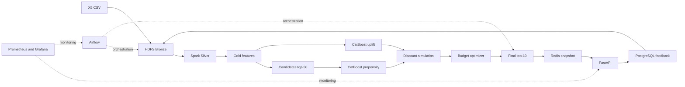

# Personalized Promo Recommender

[](https://www.python.org/)
[](https://spark.apache.org/)
[](https://airflow.apache.org/)
[](https://hadoop.apache.org/)
[](https://prometheus.io/)
[](https://grafana.com/)
[](https://redis.io/)
[](https://fastapi.tiangolo.com/)
[](https://www.docker.com/)

Personalized Promo Recommender рассчитывает персональные товарные рекомендации и
подбирает скидку с учётом вероятности покупки, uplift, маржи, промо-риска и общего
бюджета кампании.

Система обрабатывает покупки в batch-режиме, строит признаки и кандидатов в Apache
Spark, обучает CatBoost-модели, рассчитывает экономику предложений и публикует готовый
top-10 в Redis. FastAPI отдаёт активный снапшот и принимает обратную связь. Airflow
связывает этапы в воспроизводимый пайплайн, а Prometheus и Grafana показывают состояние
сервисов и качество запусков.

## Архитектура



Данные проходят через три слоя HDFS:

- Bronze хранит типизированные копии исходных CSV.
- Silver очищает покупки, проверяет связи с клиентами и товарами и публикует rejects.
- Gold содержит признаки, кандидатов, модельные оценки и финальные рекомендации.

Публикация в Redis использует неизменяемый namespace снапшота. Указатель
`promo:active_snapshot` переключается только после проверки количества ключей, JSON-схем
и TTL. Предыдущий снапшот остаётся доступен до истечения срока хранения.

## Как формируется рекомендация

Для каждого клиента система выполняет следующую последовательность:

1. Spark собирает пользовательские, товарные и парные признаки строго до
   `feature_cutoff`.
2. Генератор объединяет повторные покупки, популярные товары категории, item-to-item
   соседей и общий fallback, затем оставляет до 50 кандидатов.
3. Propensity-модель оценивает базовую вероятность покупки товара.
4. T-learner рассчитывает вероятности для treatment и control, а также uplift.
5. Simulation layer проверяет скидки 0%, 5%, 10% и 15% и считает ожидаемую прибыль,
   стоимость скидки и ROI.
6. Optimizer применяет ограничения по марже, категории, промо-риску, клиенту и бюджету.
7. Ranking нормирует прибыль и релевантность внутри клиента, ограничивает число товаров
   одной категории и публикует до 10 предложений.

`reason_code` объясняет источник решения: `HIGH_INCREMENTAL_PROFIT`,
`ORGANIC_PURCHASE_NO_DISCOUNT`, `CATEGORY_RELEVANCE`, `REPEAT_PURCHASE` или
`COLD_START_POPULAR`.

## Структура репозитория

```text
├── airflow/dags/              # DAG полного пайплайна и экспорта feedback
├── configs/                   # Версионируемые настройки расчётов и публикации
├── db/                        # PostgreSQL migrations и служебные команды
├── docker/                    # Образы API, Airflow, Hadoop и training
├── monitoring/                # Prometheus rules и Grafana provisioning
├── services/
│   ├── api/                   # Recommend, feedback, health и metrics endpoints
│   ├── feedback/              # Экспорт событий из PostgreSQL в HDFS
│   ├── monitoring/            # Метрики batch pipeline
│   ├── pipeline/              # Состояние и история запусков
│   └── publisher/             # Атомарная публикация top-N в Redis
├── spark_jobs/                # Bronze, Silver, Gold, simulation и ranking jobs
├── training/                  # Датасеты, CatBoost training, scoring и evaluation
├── tests/                     # Unit, data quality, integration и smoke tests
├── docker-compose.yml
├── Makefile
└── pyproject.toml
```

## Требования

- Python 3.11 или новее
- GNU Make
- Docker с Compose plugin

Исходные данные не входят в репозиторий. Поместите CSV в `data/raw/`:

```text
clients.csv
products.csv
purchases.csv
uplift_train.csv
uplift_test.csv
```

Каталог `data/` добавлен в `.gitignore`. Не коммитьте исходные данные, `.env`, модельные
артефакты и файлы с секретами.

## Установка

Создайте виртуальное окружение и установите зависимости разработки:

```bash
python3 -m venv .venv
.venv/bin/python -m pip install -e '.[dev]'
```

Команды Make принимают путь к интерпретатору через `PYTHON`:

```bash
make lint PYTHON=.venv/bin/python
make test PYTHON=.venv/bin/python
```

Для online-сервисов создайте локальную конфигурацию:

```bash
cp .env.example .env
```

Замените значения паролей и API-ключей в `.env` перед запуском.

## Быстрый запуск

Полный стек собирается и запускается одним Compose profile:

```bash
docker compose --profile full build
docker compose --profile full up -d
```

Инициализируйте HDFS и проверьте исходные данные:

```bash
make hdfs-bootstrap
make validate-data PYTHON=.venv/bin/python \
  FEATURE_CUTOFF=2019-03-01T00:00:00
```

Поднимите Airflow и запустите полный DAG:

```bash
make airflow-up
make trigger-daily-pipeline
```

После публикации снапшота проверьте API:

```bash
curl http://localhost:8000/health/ready

curl -X POST http://localhost:8000/v1/recommend \
  -H 'content-type: application/json' \
  -d '{"client_id":"000012768d","limit":10,"context":{"page":"main"}}'
```

Интерфейсы сервисов:

| Сервис | Адрес |
|---|---|
| FastAPI | `http://localhost:8000` |
| Airflow | `http://localhost:8080` |
| Grafana | `http://localhost:3000` |

## Ручной запуск пайплайна

Отдельные команды полезны для локальной разработки, проверки данных и повторного
расчёта конкретного слоя.

### 1. Валидация CSV

```bash
make validate-data PYTHON=.venv/bin/python \
  FEATURE_CUTOFF=2019-03-01T00:00:00
```

Проверка читает `purchases.csv` потоком, валидирует обязательные столбцы, типы,
уникальность ключей и ссылки на клиентов и товары. JSON-отчёт с ограничением числа
покупок можно получить напрямую:

```bash
.venv/bin/python -m spark_jobs.validate_raw_data \
  --data-dir data/raw \
  --feature-cutoff 2019-03-01T00:00:00 \
  --max-purchase-rows 10000 \
  --report /tmp/promo-validation-report.json
```

### 2. Bronze и Silver

Поднимите HDFS с одним NameNode, двумя DataNode и `replication=2`:

```bash
make data-up DATA_DIR=data/raw
make hdfs-bootstrap
```

Загрузите справочники и покупки:

```bash
make ingest-bronze DATA_DIR=data/raw INGEST_DATE=2026-07-01
make ingest-purchases DATA_DIR=data/raw
```

Для выборочной загрузки месяцев передайте `PURCHASE_MONTHS`:

```bash
make ingest-purchases DATA_DIR=data/raw PURCHASE_MONTHS="2019-01 2019-02"
```

Постройте Silver dimensions и очищенные покупки:

```bash
make build-silver \
  BRONZE_INGEST_DATE=2026-07-01 \
  SNAPSHOT_DATE=2026-07-01
```

Каждая публикация проходит через staging и HDFS rename. Повтор команды с теми же
параметрами заменяет только соответствующую партицию.

### 3. Gold features и кандидаты

```bash
make build-gold-features \
  DIMENSIONS_SNAPSHOT_DATE=2026-07-01 \
  FEATURE_CUTOFF=2019-03-01T00:00:00 \
  LOOKBACK_DAYS=180
```

Команда строит feedback, user, item и user-item features, а также top-50 кандидатов.
Все jobs используют полуинтервал
`[FEATURE_CUTOFF - LOOKBACK_DAYS, FEATURE_CUTOFF)` и проверяют общий snapshot contract.
Data и metadata публикуются вместе.

### 4. Обучение моделей

Сформируйте temporal propensity dataset и обучите модель:

```bash
make build-propensity-dataset \
  DIMENSIONS_SNAPSHOT_DATE=2026-07-01 \
  PROPENSITY_CUTOFFS="2019-02-01T00:00:00 2019-03-01T00:00:00" \
  LABEL_WINDOW_DAYS=30 \
  NEGATIVE_RATIO=3

make train-propensity DATASET_SNAPSHOT_DATE=2019-03-01
```

Подготовьте uplift dataset и обучите T-learner:

```bash
make build-uplift-dataset \
  DIMENSIONS_SNAPSHOT_DATE=2026-07-01 \
  FEATURE_CUTOFF=2019-03-01T00:00:00 \
  UPLIFT_VALIDATION_RATIO=0.2

make train-uplift DATASET_SNAPSHOT_DATE=2019-03-01
```

Training jobs публикуют CatBoost-модели, feature manifest, метрики и run metadata в
HDFS. Propensity использует temporal validation. Uplift dataset делится
воспроизводимым hash-порядком с сохранением комбинаций treatment и target.

### 5. Scoring, simulation и optimizer

Передайте идентификаторы опубликованных model runs:

```bash
make score-models \
  DIMENSIONS_SNAPSHOT_DATE=2026-07-01 \
  FEATURE_CUTOFF=2019-03-01T00:00:00 \
  PROPENSITY_MODEL_RUN_ID=<32-hex-run-id> \
  UPLIFT_MODEL_RUN_ID=<32-hex-run-id>
```

Рассчитайте варианты скидок и примените бизнес-ограничения:

```bash
make build-simulation \
  DIMENSIONS_SNAPSHOT_DATE=2026-07-01 \
  FEATURE_CUTOFF=2019-03-01T00:00:00 \
  SIMULATION_CONFIG=/workspace/configs/simulation.yaml

make optimize-discounts \
  FEATURE_CUTOFF=2019-03-01T00:00:00 \
  OPTIMIZER_CONFIG=/workspace/configs/optimizer.yaml

make rank-recommendations \
  FEATURE_CUTOFF=2019-03-01T00:00:00 \
  RANKING_CONFIG=/workspace/configs/ranking.yaml
```

Simulation публикует отдельную строку для каждого допустимого значения скидки.
Optimizer выбирает один вариант на пару `client_id x product_id`, распределяет бюджет
и записывает причину решения. Ranking формирует итоговый top-10.

### 6. Публикация в Redis

Поднимите PostgreSQL, Redis и API:

```bash
make online-up
```

Опубликуйте готовый recommendation snapshot:

```bash
make publish-redis \
  FEATURE_CUTOFF=2019-03-01T00:00:00 \
  ONLINE_CONFIG=/workspace/configs/online_store.yaml
```

Publisher проверяет HDFS replication, lineage, размер снапшота, JSON-схемы и TTL. После
проверки он атомарно обновляет `promo:active_snapshot` и сохраняет глобальный fallback
в PostgreSQL.

## API

| Метод | Endpoint | Назначение |
|---|---|---|
| `GET` | `/health/live` | Проверка процесса API |
| `GET` | `/health/ready` | Проверка Redis snapshot и PostgreSQL |
| `GET` | `/metrics` | Метрики Prometheus |
| `POST` | `/v1/recommend` | Персональный top-N или fallback |
| `POST` | `/v1/feedback` | Идемпотентная запись события |
| `POST` | `/v1/admin/cache/reload` | Перезагрузка локального snapshot cache |

Пример ответа `/v1/recommend`:

```json
{
  "request_id": "7f65f42e-3a63-44cc-96dc-d9a0ccd8d773",
  "client_id": "000012768d",
  "snapshot_id": "20260701T020000Z",
  "recommendations": [
    {
      "product_id": "9a80204f78",
      "discount": 0.1,
      "expected_profit": 42.5,
      "recsys_score": 0.87,
      "reason_code": "HIGH_INCREMENTAL_PROFIT"
    }
  ],
  "is_fallback": false
}
```

`client_id` хранится как строка, поэтому ведущие нули сохраняются. Неизвестный клиент
получает fallback с нулевой скидкой. API связывает показ и feedback через `request_id`,
а `event_id` защищает запись события от дубликатов.

Локальный cache активного снапшота можно обновить без перезапуска API:

```bash
make reload-api-cache ADMIN_API_KEY=<значение-из-.env>
```

## Feedback loop

API записывает показы и события `click`, `cart` и `purchase` в PostgreSQL. Exporter
читает ограниченный batch по watermark `(received_at, event_id)`, дедуплицирует события
и публикует их в HDFS по `event_date`:

```bash
make export-feedback
```

Airflow DAG для экспорта запускается отдельно:

```bash
make airflow-up
make trigger-feedback-export
```

Следующий запуск feature pipeline агрегирует feedback в окна 30, 90 и 180 дней. В
признаки входят только проверенные события, созданные и полученные до cutoff.

## Мониторинг

Запустите Prometheus и Grafana:

```bash
make monitoring-up
```

Готовый Grafana dashboard показывает:

- состояние API, Redis, PostgreSQL и HDFS;
- длительность и статус Airflow DAG;
- Spark rows, memory и shuffle metrics;
- распределения propensity, uplift и скидок;
- ожидаемую прибыль, расход бюджета и promo ROI;
- объём и задержку feedback.

Prometheus загружает alert rules из репозитория. Правила отслеживают доступность API и
HDFS, свежесть пайплайна, память Redis и распределение опубликованных скидок.

## Тесты и качество кода

Быстрые проверки не запускают Docker:

```bash
make lint PYTHON=.venv/bin/python
make test PYTHON=.venv/bin/python
```

Smoke-тесты обучения:

```bash
make test-training
```

Интеграционная проверка HDFS использует отдельный Compose project и синтетические
fixtures:

```bash
make test-hdfs
```

Полный набор проверок:

```bash
make test-all
```

Тесты покрывают контракты CSV и Parquet, cutoff и leakage rules, HDFS replication,
атомарную публикацию, обучение и scoring, ограничения optimizer, API fallback,
идемпотентность feedback и Airflow DAG.

## Конфигурация

Расчётные параметры хранятся вне кода:

| Файл | Назначение |
|---|---|
| `configs/margin_seed.csv` | Ставки маржи по `level_2` |
| `configs/simulation.yaml` | Сетка скидок и параметры экономики |
| `configs/optimizer.yaml` | Budget, margin, category и user constraints |
| `configs/ranking.yaml` | Веса ranking и diversity cap |
| `configs/online_store.yaml` | TTL, размер Redis snapshot и fallback |
| `configs/feedback_export.yaml` | Размер batch и параметры экспорта |

Каждый pipeline run фиксирует config fingerprint, cutoff, run IDs, snapshot IDs и
сводные метрики в PostgreSQL. Metadata рядом с HDFS-данными хранит входные партиции,
схему и lineage публикации.

## Лицензия

Код распространяется по лицензии, указанной в файле [LICENSE](LICENSE).
